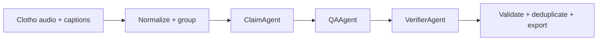

# Audio-CF: Counterfactual Audio Reasoning

**A caption-grounded data pipeline for testing whether audio models can judge a textual claim and identify the recording that determines the answer.**

Audio-CF builds supported and contradicted claim–question–answer examples from
[Clotho v2.1](https://zenodo.org/records/4783391). Counterfactual claims change a
central detail of a captioned event, creating misleading text that a downstream
audio model must resolve using the recordings. Each example includes the audio
references, claim, question, evidence judgment, and one determining source.

The current research prototype implements data preparation, synthetic example
generation, automated validation, and on-policy teacher-to-student distillation.

[Example](#task-and-example) · [Pipeline](#how-it-works) ·
[Quick start](#quick-start) · [Distillation](#on-policy-knowledge-distillation) ·
[Configuration](#configuration-and-large-runs)

## Task and example

Given one or more audio clips, a claim, and a question, the target answer has
exactly two entries: `"supported"` or `"contradicted"`, followed by an `AUDIO_k`
source label. The default configuration groups two clips per unit; larger groups
are also supported, while each claim has one determining source.

This excerpt comes from the checked-in
[human-review sample](sample_for_human_review.jsonl), which uses three clips per
unit. The reference caption for `AUDIO_1` is:

> A cat is meowing several times in distress as it moves and knocks an object.

```json
{
  "claim_text": "A dog is barking several times in distress as it moves and knocks an object.",
  "question": "Is the claim that a dog is barking in distress while knocking an object supported or contradicted, and which recording determines this?",
  "answer": ["contradicted", "AUDIO_1"]
}
```

The animal and vocalization conflict with the reference caption. The remaining
scene details can still agree with it.

Supported claims require explicit caption evidence. Contradicted claims require
a central detail that conflicts with positive evidence from the same audio;
caption omission alone is insufficient. Generation and verification use captions
as the reference, so a contradiction label describes a caption conflict rather
than proving that an alternative sound is physically absent from the waveform.

## How it works



1. **Prepare the evidence.** Normalize audio paths, captions, metadata, and
   provenance into a manifest. Group clips using seeded random sampling or
   lexical caption similarity.
2. **Generate a claim.** ClaimAgent receives a target label/source and up to three
   rotating captions per relevant audio. It produces a claim with supporting
   caption phrases and, when applicable, a contradiction basis.
3. **Write the question.** QAAgent receives the validated claim and produces a
   question and explanation. Python constructs the canonical answer and source
   fields from the claim, keeping the labels consistent.
4. **Verify and export.** A separate VerifierAgent call checks the complete
   example against relevant captions. Failed candidates are rejected; accepted
   candidates pass schema and consistency checks before deduplication and export.

The pipeline uses schema-constrained JSON, bounded retries, asynchronous requests
with concurrency limits, and atomic batch checkpoints. Prompts omit file names,
IDs, and paths. By default, it attempts two candidates per unit and removes
near-duplicates within the same unit while retaining distinct label/source
contrasts. Questions always ask for the evidence judgment; asking for the source
in the question is optional, while the answer always includes it.

## Quick start

The project uses **Python 3.12**. The supplied generation profiles target Linux
with an NVIDIA GPU and vLLM; their starting configuration is one H100 80 GB.
Data preparation and the dry run below do not require a running inference server.
All commands below use Bash and run from the repository root.

```bash
git clone https://github.com/riverside234/audio-cf.git
cd audio-cf

conda create --name audio-cf python=3.12 -y
conda activate audio-cf
python -m pip install --upgrade pip
python -m pip install -r requirements.txt
```

See the [vLLM GPU installation guide](https://docs.vllm.ai/en/latest/getting_started/installation/gpu/)
for driver, wheel, and Docker options. The model profiles correspond to the vLLM
version range in [requirements.txt](requirements.txt).

### 1. Prepare a small set of audio units

Download these development-split files from
[Clotho v2.1 on Zenodo](https://zenodo.org/records/4783391) into `data/`
(subfolders are also accepted):

- `clotho_audio_development.7z`
- `clotho_captions_development.csv`
- `clotho_metadata_development.csv`

Build the manifest, then sample 20 pairs from 40 recordings:

```bash
python data_process.py \
  --clotho-root data \
  --output-dir data/log \
  --splits development

python data_filter.py \
  --config configs/data_filter.yaml \
  --subset-size 40 \
  --unit-count 20 \
  --audio-count 2
```

`data_process.py` extracts archives automatically when needed. It currently uses
CLI arguments; [configs/data_process.yaml](configs/data_process.yaml) documents
its defaults. The filtering step writes `data/final/audio_units.parquet`, the
input to synthetic generation.

### 2. Validate the setup without model calls

```bash
python data_synthetic.py \
  --config configs/data_synthetic.yaml \
  --max-units 5 \
  --output-dir data/synthetic/setup_check \
  --dry-run
```

This loads the configuration, prompt paths, and input rows, then writes a config
snapshot and statistics without contacting vLLM.

### 3. Serve a model and generate examples

Gemma 4 is the default profile. Before starting it, update `model` and
`download-dir` in [configs/vllm_server_gemma4.yaml](configs/vllm_server_gemma4.yaml)
to point to your checkpoint and cache directory. Both server YAML files contain
lab-specific paths. The client's `model` must match the server's
`served-model-name`.

Start the server in one terminal:

```bash
# Use a scratch directory for vLLM's compilation and runtime caches.
export VLLM_CACHE_ROOT="${TMPDIR:-/tmp}/audio-cf-vllm"
mkdir -p "$VLLM_CACHE_ROOT"

CUDA_VISIBLE_DEVICES=0 VLLM_USE_V2_MODEL_RUNNER=0 \
  vllm serve --config configs/vllm_server_gemma4.yaml
```

Once the server is ready, activate the environment in a second terminal, return
to the repository root, and run:

```bash
python data_synthetic.py \
  --config configs/data_synthetic.yaml \
  --vllm-config configs/vllm_client_gemma4.yaml \
  --max-units 5 \
  --output-dir data/synthetic/gemma4_smoke
```

Use a fresh output directory for each run. `--overwrite` replaces existing run
outputs, including saved batches.

<details>
<summary>Alternative model: Qwen3.8-27B</summary>

Update `model` and `download-dir` in
[configs/vllm_server_qwen38.yaml](configs/vllm_server_qwen38.yaml) first.
Stop the Gemma server before switching: both profiles use port 8000.

Start the Qwen server in one terminal:

```bash
export VLLM_CACHE_ROOT="${TMPDIR:-/tmp}/audio-cf-vllm"
mkdir -p "$VLLM_CACHE_ROOT"

CUDA_VISIBLE_DEVICES=0 VLLM_USE_V2_MODEL_RUNNER=0 \
  vllm serve --config configs/vllm_server_qwen38.yaml \
  --gdn-prefill-backend triton
```

Run generation in a second terminal:

```bash
python data_synthetic.py \
  --config configs/data_synthetic.yaml \
  --vllm-config configs/vllm_client_qwen38.yaml \
  --max-units 5 \
  --output-dir data/synthetic/qwen38_smoke
```

</details>

## Outputs

The repository includes [examples.parquet](examples.parquet) and a
[human-review sample](sample_for_human_review.jsonl) for inspecting the data
format. New runs write the following artifacts under their output directory:

| Artifact | Purpose |
| --- | --- |
| `examples.parquet` | Canonical examples: audio references, claim, label, source, question, and answer |
| `examples_audit.parquet` | Agent records, caption evidence, explanations, and verifier decisions |
| `sample_for_human_review.jsonl` | Up to 20 audit records for manual inspection |
| `generation_config_used.yaml` | Snapshot of the generation and client configuration |
| `stats.json` | Progress, accepted examples, failures, and deduplication counts |
| `events.jsonl` / `errors.jsonl` | Run events and structured failure records |

Audit output is enabled by default; the duplicate final `examples.jsonl` export
is disabled. Completed batches are saved under `generation_batches/` while a run
is active. They remain available after interruption and are removed after
successful finalization.

The current example schema is `synthetic_example_v4`. Use separate output
directories for runs with different schema versions.

## On-policy knowledge distillation

[on_policy_distillation/](on_policy_distillation/) trains
[Qwen2.5-Omni-3B](https://huggingface.co/Qwen/Qwen2.5-Omni-3B) from a frozen
[Qwen3-Omni-30B-A3B-Instruct](https://huggingface.co/Qwen/Qwen3-Omni-30B-A3B-Instruct)
teacher using [MS-Swift's OPD-RL](https://swift.readthedocs.io/en/v4.5/Instruction/Distillation.html).
The student samples answers from the current policy. The teacher scores those
same response tokens, and Swift uses the teacher/student log-probability ratio
as a per-token training signal. The defaults use pure distillation with one
student rollout per prompt, no task rewards, and no reference-model KL penalty.

Both models receive the ordered recordings, claim, and question. The exporter
keeps the dataset's two-label answer as a reference assistant message; Swift
removes it before student generation. Captions and audit explanations are
excluded from the prompt. LoRA trains the student's language layers while the
audio/vision encoders and aligners stay frozen; speech output is disabled.

The models share their base text vocabulary but use different audio tokens.
A separate teacher service lets Swift apply each model's own audio processor.
The small training wrapper checks text-token compatibility and rejects sampled
response tokens whose IDs have different meanings between the models. Swift
handles rollouts, teacher scoring, the loss, optimization, and checkpoints.

### Set up and export the current dataset

Use a Linux/CUDA host and a separate training environment:

```bash
conda create --name audio-cf-opd python=3.12 -y
conda activate audio-cf-opd
python -m pip install -r on_policy_distillation/requirements.txt

python -m on_policy_distillation.prepare \
  --input examples.parquet \
  --audio-root "$PWD" \
  --output data/distillation/train.jsonl
```

The recordings must exist locally. `--audio-root` is the base for the relative
paths stored in the dataset; absolute paths are used directly. The exporter
tries `local_audio_paths` first, then the corresponding `audio_file_names`
release path, preserving `AUDIO_1 ... AUDIO_N` order. Missing recordings fail
the export. To use a new generation run, pass its `examples.parquet` path to
`--input`; `--limit 4` exports a small smoke-test subset.

### Start the teacher, then train the student

In one terminal, serve the teacher on GPUs reserved for inference:

```bash
CUDA_VISIBLE_DEVICES=1,2 bash on_policy_distillation/serve_teacher.sh
```

The service listens at `http://localhost:8001` and allows up to three recordings
per prompt. `TEACHER_MODEL` accepts a local checkpoint path; `TEACHER_PORT`,
`TENSOR_PARALLEL_SIZE`, and `MAX_AUDIOS` override the server defaults.

Once the service is ready, run a short training smoke test in another terminal
with separate student GPUs:

```bash
CUDA_VISIBLE_DEVICES=0 python -m on_policy_distillation.train \
  --max_steps 2 \
  --gradient_accumulation_steps 1 \
  --save_steps 1
```

For the full run, use `CUDA_VISIBLE_DEVICES=0 python -m on_policy_distillation.train`.
The wrapper accepts native Swift training flags, including `--dataset`,
`--model`, `--learning_rate`, and `--resume_from_checkpoint`. Set `TEACHER_URL`
for a different service address, and set the same `TEACHER_MODEL` in both
terminals when using a local teacher checkpoint. Student rollouts use
Transformers by default, so an additional student inference service is optional.

LoRA checkpoints and completion logs are saved under
`data/distillation/checkpoints/`. All exported rows are used for training;
evaluation requires a separate split with disjoint source recordings because
audio units can reuse clips. This repository provides the training entry points;
trained adapters and measured distillation results are not checked in.

## Configuration and large runs

The checked-in defaults target a larger generation run:

| Setting | Default |
| --- | --- |
| Eligible split | Clotho development |
| Audio grouping | Random, seed `42`, two clips per unit |
| Target audio units | `100,000` |
| Candidates attempted per unit | `2` |
| Within-unit text similarity threshold | `0.90` |
| Units per checkpoint batch | `256` |
| Model profile | Gemma 4 |
| Runner / client concurrency | Gemma: `32`; Qwen: `64` |

The quick start overrides the sampling size and limits generation to five units.
For a larger run, regenerate units using
`python data_filter.py --config configs/data_filter.yaml --overwrite` and omit
`--max-units` from the generation command. Accepted example counts depend on
validation failures and deduplication. The random seed controls data grouping;
model generation uses stochastic sampling.

- [configs/data_filter.yaml](configs/data_filter.yaml): input splits, sampling,
  audio count, grouping strategy, and clip reuse limits.
- [configs/data_synthetic.yaml](configs/data_synthetic.yaml): candidate count,
  deduplication threshold, output formats, and audit settings.
- [Gemma client profile](configs/vllm_client_gemma4.yaml) /
  [Qwen client profile](configs/vllm_client_qwen38.yaml): endpoint, prompts,
  sampling parameters, retries, concurrency, and batch size.

<details>
<summary>GPU serving and structured-output notes</summary>

- Both profiles use `dtype: auto`, an 8,192-token context, a 3,072-token completion
  budget, and a 2,048-token thinking cap. Keep `VLLM_USE_V2_MODEL_RUNNER=0` for
  these budgeted-thinking profiles.
- ClaimAgent uses temperature/top-p `0.7/0.95`; QAAgent uses `0.5/0.95`;
  VerifierAgent uses greedy decoding.
- Gemma uses the `gemma4` reasoning parser and xgrammar with arbitrary JSON
  whitespace disabled. `reasoning_effort: medium` enables thinking; the numeric
  cap is set by `thinking_token_budget`.
- Qwen uses the `qwen3` reasoning parser, text-only loading, and xgrammar enabled
  during reasoning. Its client can recover a complete JSON object from the
  reasoning field when the parser places it there. Reasoning prose is rejected.
  This profile leaves speculative decoding off; the launch command selects the
  Triton GDN prefill backend.
- If vLLM reports KV-cache preemption or runs out of memory, lower the client,
  runner, and server concurrency settings together. Set `VLLM_CACHE_ROOT` in
  every server shell or batch job, and restart the server after YAML changes.

</details>

## Repository guide

| Path | Role |
| --- | --- |
| [data_process.py](data_process.py) | Normalize Clotho files and record provenance |
| [data_filter.py](data_filter.py) | Sample recordings and construct audio units |
| [data_synthetic.py](data_synthetic.py) | Configure and run synthetic generation |
| [synthetic/agents/](synthetic/agents/) | Claim, QA, verifier, validation, and candidate-selection logic |
| [synthetic/infrastructure/](synthetic/infrastructure/) | Model client, retries, prompts, logging, and output persistence |
| [prompts/synthetic/](prompts/synthetic/) | Versioned agent prompts |
| [configs/](configs/) | Data, model-client, and vLLM-server profiles |
| [on_policy_distillation/](on_policy_distillation/) | Audio conversation export, teacher service, and MS-Swift OPD-RL training |
| [tests/](tests/) | Unit tests for generation, validation, clients, configs, and batch output |

## Tests

```bash
python -m unittest discover -s tests -v
```

The unit tests use mocked model responses and do not require a live vLLM server.

## Dataset attribution

Audio and reference captions come from **Clotho**, created by Konstantinos
Drossos, Samuel Lipping, and Tuomas Virtanen. See the
[v2.1 dataset release](https://zenodo.org/records/4783391) and
[Clotho: an Audio Captioning Dataset](https://arxiv.org/abs/1910.09387)
for the source data and citation.
